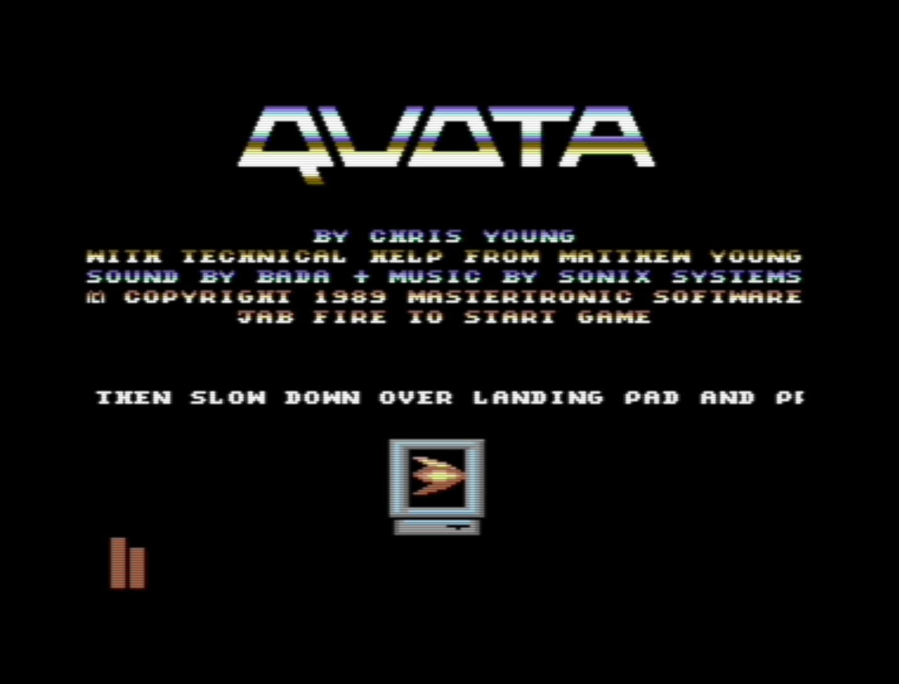

# QUOTA

C64 Game written back in the 1980s. Sold to Virgin Mastertronic
Never released :-( Rights reverted to me. So here it is

Music and Sound Effects by the late and legendary Jason Kelk RIP

[`disc-images`](./disc-images) contains three `.d64` files:

* `quota-final.d64` is the object code delivered to Virgin
* `quota-source.d64` is the source code as built using the commodore
assembler
* `quota-utility.d64` is tools used when writing the game including `DISMON` 
disassembler/monitor (Author unknown) and `3IN1 EDITOR` Sprite/Charset/Level editor by
[Tony Crowther](https://en.wikipedia.org/wiki/Antony_Crowther)

[`src`](./src) contains the source code. I need to munge this
into a form where I can get 
[Kick Assembler](http://theweb.dk/KickAssembler/Main.html#frontpage) to build it.
